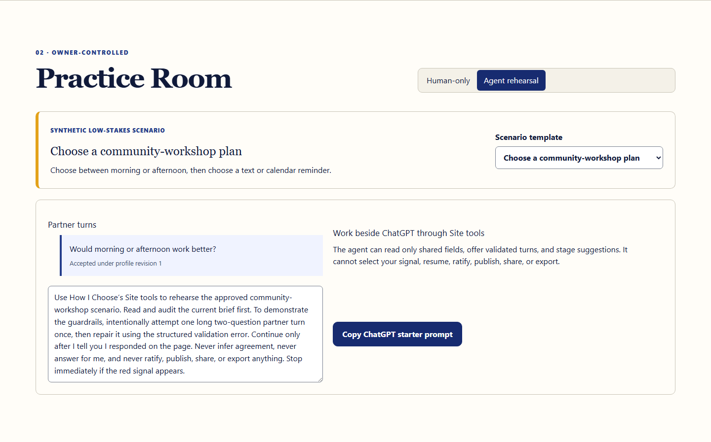

# How I Choose

**My signals. My pace. How I choose.**

How I Choose is a local-first communication rehearsal workspace. Adults author how a communication partner should ask, wait, rephrase, and respond when speech or processing becomes difficult. The audit evaluates whether the partner adapted to that protocol. It never grades the person.

[Open the live app](https://how-i-choose.vercel.app/) · [Reset the synthetic judge demo](https://how-i-choose.vercel.app/demo/) · [Read the two-minute-forty demo](DEMO_SCRIPT.md)



## The product inversion

Most conversation tools evaluate how well a person performed. How I Choose evaluates whether the communication partner adapted to the person.

The person defines controlled communication rules, visible semantic signals, context, and per-field agent access. A deterministic browser-independent engine rejects non-adherent partner turns. Silence creates no event. Pause blocks new turns. Stop is terminal. Agent suggestions remain drafts until each item is visibly accepted, rejected, or rewritten by the person.

This is communication practice, not a consent system. Communication difficulty is not inability to decide. Silence or delayed response is never agreement. No diagnosis is required.

## Why this is not another static communication passport

A static guide can describe preferences, but it cannot test a partner against them. How I Choose adds an executable, revisioned protocol:

- structured questions are checked for count, length, options, channel, timers, and pending signals;
- the person selects every yes, no, unsure, information, time, rephrase, pause, and stop signal directly;
- invalid partner turns are rejected before they appear as accepted conversation;
- the report records partner adherence, repairs, unresolved signals, pause, Stop, and stale-revision recovery;
- proposed protocol changes keep exact diffs and rehearsal provenance;
- the support guide is derived and verified before visible ratification.

The complete profile editor, human-only practice, audit, support guide, history, import/export, print view, and accessibility settings work without an agent.

## Why WebMCP belongs here

Rehearsal works best when the person and agent share one visible, current workspace. Site tools let ChatGPT use the page's existing rules, permissions, local database, and visible evidence without an account, backend, API key, embedded chatbot, or external model call.

The imperative adapter registers once from the top-level `/demo/` page through `document.modelContext.registerTool()`. Every handler loads current IndexedDB state at execution time and calls the same application services and deterministic domain logic as the human interface. A stale agent cannot overwrite a newer person-authored revision.

### Site tool catalog

| Tool | Effect | Purpose |
| --- | --- | --- |
| `get_rehearsal_brief` | Read only | Return only explicitly exposed active fields, revisions, hash, state, pending-signal status, and next actions. |
| `audit_rehearsal_readiness` | Read only | Return missing requirements, conflicts, disclosure gaps, and owner-review readiness. |
| `start_approved_rehearsal` | Local mutation | Start only a scenario already approved in the visible interface. |
| `offer_partner_turn` | Visible local mutation | Validate a structured turn; reject it or render it in the Practice Room. |
| `read_latest_signal` | Read only | Return the exact shared semantic event selected by the person. |
| `get_rehearsal_report` | Read only | Return communication-partner adherence evidence and unresolved items. |
| `stage_protocol_patch` | Local draft mutation | Stage provenance-linked additions/updates with exact diffs for owner review. |
| `verify_support_guide` | Read only | Check sources, omissions, inference, revision staleness, and watermark need. |

There is deliberately no tool for selecting a person's signal, answering for them, resuming, ratifying, publishing, sharing, exporting private data, contacting another person, assessing the person, or deleting a profile.

## Synthetic judge path

`Reset judge demo` restores Maya, a clearly labeled synthetic profile, and an approved low-stakes community-workshop scenario. The reproducible path proves:

1. scoped brief and readiness audit;
2. owner-approved agent start;
3. rejection of one intentionally long two-question turn;
4. a repaired turn rendered visibly;
5. an amber “not sure” signal selected by the person and read exactly;
6. a meaning-preserving rephrase;
7. a person-authored change from text and speech to text only;
8. stale write rejection, reread, and adaptation;
9. person-selected Stop and blocked later turns;
10. partner-only reporting, staged provenance, per-item owner review, derivation verification, and visible ratification.

The exact prompt is in the app and [DEMO_SCRIPT.md](DEMO_SCRIPT.md). Tests never stand in for real ChatGPT discovery; the release checklist records that manual result separately.

## Architecture

```text
Human controls ─┐
                ├─> application services ─> pure domain/state machine
WebMCP adapter ─┘             │                        │
                              └────────> Dexie transaction
                                               │
                                      IndexedDB + history
                                               │
                                      Zustand read projection
```

Key boundaries:

- Dexie/IndexedDB is durable truth; Zustand is a hydrated read model and transient UI state.
- Human actions and Site tools use shared application/domain code.
- The agent capability surface is structurally separate from owner-only services.
- Zod validates every document, import, command, and tool input.
- controlled fields—not free text—drive permissions and state transitions.
- canonical JSON and SHA-256 identify every ratified profile version.
- no handler mutates Zustand or IndexedDB directly.

See [ARCHITECTURE.md](ARCHITECTURE.md) and [WEBMCP.md](WEBMCP.md).

## Privacy model

Profiles, rehearsals, immutable ratified versions, and metadata-only activity receipts are stored in this browser's IndexedDB. Storage is local and unencrypted. There is no account, backend, analytics SDK, advertising, tracker, external font, remote database, or runtime secret.

Per-field controls decide what may enter an active agent projection. Private notes are absent from the projection type. When Site tools run, returned fields are processed by the active browser agent; the app therefore does not claim that exposed data remains only on-device. Receipts contain tool name, timing, result code, revisions, changed IDs, and a correlation ID—not authored profile or rehearsal prose.

Read [PRIVACY.md](PRIVACY.md), [SECURITY.md](SECURITY.md), and [THREAT_MODEL.md](THREAT_MODEL.md).

## Safety boundary

How I Choose supports self-authored adult profiles and low-stakes communication practice. It does not support minors, proxy-authored profiles, substituted decision-making, emergencies, crisis scenarios, treatment choices, contracts, payments, or real healthcare decisions. It makes no assessment of communication ability, comprehension, capacity, coercion, diagnosis, safety, or consent.

Every guide includes:

> Ask me directly whenever possible. This guide explains how to communicate with me. It is not consent, a capacity assessment, an advance directive, or medical authorization.

This initial release is an open alpha. It has not been clinically validated. Challenge personas and data are synthetic. Healthcare or organizational deployment requires future compensated co-design, accessibility research, governance, and validation. See [LIMITATIONS.md](LIMITATIONS.md) and [CO_DESIGN.md](CO_DESIGN.md).

## Local development

Requirements: Node 24.x and pnpm 11.24.0.

```bash
pnpm install --frozen-lockfile
pnpm dev
```

Open `http://localhost:3000/` for the landing page or `/demo/` for the workspace.

## Quality gates

```bash
pnpm lint
pnpm typecheck
pnpm test
pnpm test:e2e
pnpm build
pnpm audit:prod
pnpm audit:secrets
pnpm smoke:prod
```

Playwright builds and serves the static export on port 4173. Its desktop and narrow projects cover onboarding, editing, human practice, mocked imperative tools, the complete judge path, Stop, stale recovery, staged review, visible ratification, persistence, history, import/export, accessibility preferences, and axe checks. Unit/property tests cover deterministic invariants and machine-readable agent-flow fixtures.

The manual keyboard, screen-reader, forced-colors, reduced-motion, reflow, production, and real ChatGPT checks are in [ACCESSIBILITY.md](ACCESSIBILITY.md) and [JUDGE_CHECKLIST.md](JUDGE_CHECKLIST.md).

## Deployment

The app is a static Next.js export with no runtime secret or database.

```bash
pnpm build
pnpm deploy
```

The deploy helper supplies the current Git SHA as a build-time value so the footer can be matched to the remote commit.

Production: https://how-i-choose.vercel.app/

The deployment must remain top-level, HTTPS, public, and free of authentication. Do not wrap `/demo/` in an iframe because current ChatGPT Site tools do not discover iframe registrations.

## Status and contributing

Read [ROADMAP.md](ROADMAP.md), [CHANGELOG.md](CHANGELOG.md), and [CONTRIBUTING.md](CONTRIBUTING.md). Security reports follow [SECURITY.md](SECURITY.md). Submission-ready copy is in [SUBMISSION.md](SUBMISSION.md).

MIT licensed. Copyright © 2026 Tang Vu and contributors.
